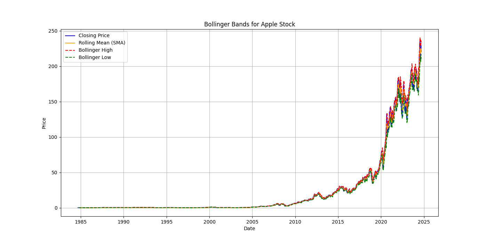

# Bollinger Bands Analysis

## Overview

This project involves analyzing historical stock data to visualize Bollinger Bands, a popular technical analysis tool used to measure market volatility and identify potential trading signals. The analysis is performed using Python with visualizations created using Matplotlib.

## Bollinger Bands

Bollinger Bands consist of three lines plotted on a price chart:

- **Middle Band**: A simple moving average (SMA) of the closing prices over a specified period (typically 20 days).
- **Upper Band**: The middle band plus two times the standard deviation of the closing prices over the same period.
- **Lower Band**: The middle band minus two times the standard deviation of the closing prices.

### How Bollinger Bands Work

- **Volatility**: The distance between the upper and lower bands indicates market volatility. Wider bands suggest high volatility, while narrower bands suggest low volatility.
- **Price Levels**: Prices close to or touching the upper band might be considered overbought, while prices near or touching the lower band might be considered oversold.
- **Band Squeeze**: When bands contract, it signals a period of low volatility and potential for a breakout. When bands expand, it indicates increased volatility.

## Project Structure

- `bollinger_band_analysis.py`: The main Python script that performs data analysis and generates visualizations.
- `aapl_us_d.csv`: The CSV file containing historical Apple stock data.

## Features

- **Bollinger Bands Calculation**: Calculates the middle, upper, and lower bands based on historical stock data.
- **Visualization**: Plots the Bollinger Bands along with the closing prices to help identify potential trading signals and market volatility.
- **Image Output**: Saves the plot as an image file for review and reporting.

## Requirements

To run this project, you need to have the following Python packages installed:

- `pandas`
- `matplotlib`

You can install these packages using pip:

`pip install pandas matplotlib`

## How to Run

To run this project and generate the Bollinger Bands plot, follow these steps:

1. **Download the Dataset**: Ensure you have the `aapl_us_d.csv` file in the same directory as the Python script.

2. **Install Dependencies**: Install the required Python packages if you haven't already. You can do this using `pip`:

   `pip install pandas matplotlib`

3. **Run the Script**: Execute the Python script to perform the analysis and generate the plot. Use the following command:

   `python bollinger_band_analysis.py`

4. **View the Output**: After running the script, it will save the plot as an image file named `bollinger_bands.png` in the current working directory. You can open this image file to view the visualization of the Bollinger Bands.

   `bollinger_bands.png`

## Example Plot

## License

This project is licensed under the MIT License - see the [LICENSE](LICENSE) file for details.
